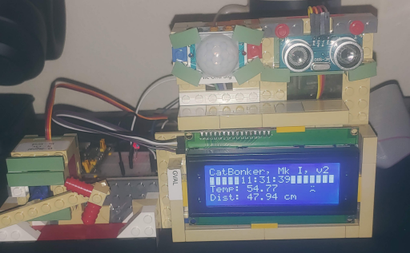

Learnin' stuff and experiments not intended to be taken seriously.

Aside from the image, the code is archived in the "learning" branch.

### Cat Bonker, Mark I

- [diozero](https://www.diozero.com/) library
  - **Note** I am a recent, minor contributor
- Kotlin 1.8.0
- Raspberry Pi B+

- uses the remains of a Statue of Liberty LEGO set
  - lots of odd bricks
  - "mostly" manages to fit
  - v1 had a different "arm" and actually bonked a cat, thus the name
- 20x4 display
- Ultrasonic range-finder
- IR sensor
  - lights up LED in on the breadboard in the background
- Servo
  - has an "arrow" stuck on the spindle
  - reacts based on range-finder

### Radar Love

A servo motor sweeps back and forth, "pinging" with a range-finder, painting the distance to objects on an OLED.

- [SonarScreen.kt](src/main/kotlin/kobots/demo/SonarScreen.kt)
- Raspberry Pi B+
- Adafruit [CRICKIT Hat](https://www.adafruit.com/product/3957)
- HC SR04 UltraSonic Ranging Module
  - note: will **NOT** run from the CRICKIT due to tight timing constraints
  - via [GPIO expander](https://www.amazon.com/dp/B08RDYDG6X?psc=1&ref=ppx_yo2ov_dt_b_product_details) (the pretty lights)
  - there's another version without the lights, but they're pretty useful for diagnostics
- SG90 servo (in the box underneath)
- SparkFun [Qwiic Hat](https://www.adafruit.com/product/4688)
  - used this version because it doesn't cover the CRICKIT
- Grayscale 1.5" [OLED](https://www.adafruit.com/product/4741)
- more LEGO
  - the [servo mount](../diagrams/SG90%20Mount.ldr) is actually a **VERY** good fit
  - plans to sacrifice a 4x4 plate (drill a hole in it) to get a better attachment to the servo
