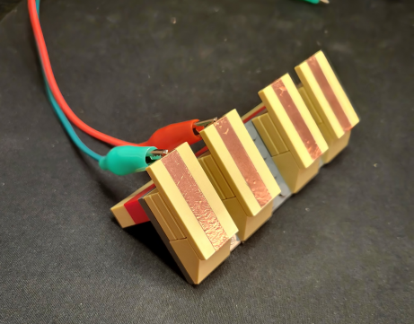

# Sub-Structures

See the [Google Album](https://photos.app.goo.gl/kWWJ8uUjWdHnsVDY6) for more.

### SG90 Servo Mount

- uses studs-on-side for friction fit on the X and Y-axis
- top plates prevent any Z-axis motion
- typical plastic horn clears top plate by approximately 1-plate height
- used for [Radar Love](../adhoc/Radar%20love.jpg) construct
- [plans](SG90%20Mount.ldr)

### Fan Mount

- power wires will _just_ friction-fit between two round plates
- [plans](Fan%20Mount.ldr)

### Touch Pads

- just copper tape on tiles for capacitive touchpads (like on a [CRICKIT](https://www.adafruit.com/product/3957))
- used in lots of initial projects for simple controls
- [plans](Touchpads.ldr)

### Basic Stepper Mount

 (lids off)

- board is a typical ULN2003 approximately 30mm by 30mm
- 
